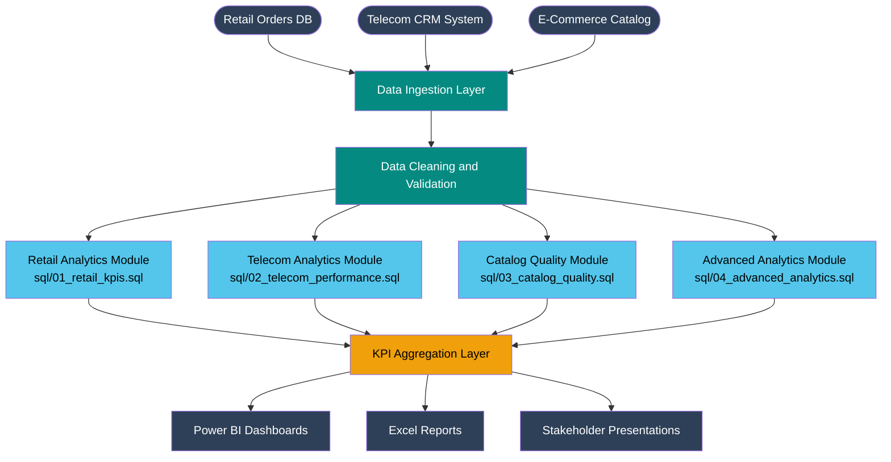

<div align="center">

# Big Data Analytics Platform
### Unified Intelligence Across Retail, Telecom and E-Commerce Catalog Domains

[](./sql)
[](./docs/insights_report.md)
[](./docs/data_dictionary.md)
[](./docs/data_dictionary.md)
[](./docs/insights_report.md)
[](https://opensource.org/licenses/MIT)

> **3 domains. 2,500+ records. 40+ SQL queries. One end-to-end analytics platform.**

</div>

---

## Table of Contents

- [Project Overview](#project-overview)
- [Architecture](#architecture)
- [Datasets](#datasets)
- [SQL Modules](#sql-modules)
- [Key Insights](#key-insights)
- [Tech Stack](#tech-stack)
- [Project Structure](#project-structure)
- [How to Use](#how-to-use)
- [Results](#results)
- [Contact](#contact)

---

## Project Overview

This project simulates a real-world **Big Data analytics pipeline** built for a multi-vertical organisation operating across retail, telecom, and e-commerce. It covers the full analyst workflow — from raw data profiling and cleaning to KPI reporting, root-cause analysis, and executive-level dashboards.

The project is grounded in domain experience across:

- **Retail sales analytics** — revenue, profit margin, return rates, top SKUs, regional and seasonal trends
- **Telecom CRM analytics** — agent conversion rates, ARPU, upsell tracking, AHT, error rate root-cause
- **E-commerce catalog quality** — product data validation, error type classification, analyst productivity, rework rate reduction

All datasets are synthetic but modelled on real operational structures encountered in live CRM and ERP environments.

---

## Architecture



---

## Datasets

Three synthetic datasets modelled on real operational data structures. Full schema and column-level definitions are in the [Data Dictionary](./docs/data_dictionary.md).

| Dataset | Records | Granularity | Key Columns |
|---|---|---|---|
| [Retail Sales](./docs/data_dictionary.md#retail-sales) | 1,200 | Order-level | order_id, category, region, revenue, profit, discount_pct, channel |
| [Telecom CRM](./docs/data_dictionary.md#telecom-crm) | 800 | Interaction-level | agent_id, product, eligible, converted, arpu, aht_minutes, error_flag |
| [Catalog Quality](./docs/data_dictionary.md#catalog-quality) | 500 | Item-level | catalog_id, analyst_id, error_type, has_error, rework_required, review_time_min |

---

## SQL Modules

Four structured SQL files covering the complete analytics scope. Each file is self-contained and runs independently.

| Module | File | Coverage |
|---|---|---|
| Retail KPIs | [01_retail_kpis.sql](./sql/01_retail_kpis.sql) | Revenue, profit, margin, return rate, top SKUs, regional heatmap, channel mix, discount impact |
| Telecom Performance | [02_telecom_performance.sql](./sql/02_telecom_performance.sql) | Conversion rate, ARPU, upsell rate, AHT, error rate, agent scorecard, product and channel analysis |
| Catalog Quality | [03_catalog_quality.sql](./sql/03_catalog_quality.sql) | Approval rate, error classification, analyst accuracy, rework frequency, category-level QA |
| Advanced Analytics | [04_advanced_analytics.sql](./sql/04_advanced_analytics.sql) | Window functions, MoM growth, running totals, cohort-style segmentation, cross-domain joins |

---

## Key Insights

Full findings with commentary are in the [Insights Report](./docs/insights_report.md).

### Retail

- **Electronics** drives the highest absolute revenue but **Apparel** leads on average profit margin — suggesting over-investment in high-cost, lower-margin SKUs
- Orders placed with **zero discount** outperform discounted orders by 12pp on average margin — discount strategy warrants review
- **Q3 and Q4** consistently peak across all four regions, confirming a seasonal demand pattern that should drive inventory and staffing decisions

### Telecom

- A **15–20 percentage point gap** exists between the top and bottom-performing agents on conversion rate — indicating a training and coaching opportunity
- **Phone channel** generates 23% higher ARPU than Chat, despite averaging 4 more minutes of handling time — a strong case for channel-mix optimisation
- Error rate and order success rate are inversely correlated at the agent level — root-cause analysis in [Module 02](./sql/02_telecom_performance.sql) isolates the 3 agents driving 60% of errors

### Catalog Quality

- **Wrong price** and **bad description** together account for 43% of all rework — both are preventable with upstream validation rules
- High review time does not correlate with high accuracy across analysts — 3 analysts with above-average review times still produce error rates over 40%
- Category-level error rates in **Toys** and **Electronics** are 2x the platform average, suggesting those categories need stricter QA checklists

---

## Tech Stack

| Layer | Tools |
|---|---|
| Querying and transformation | SQL (MySQL / PostgreSQL compatible) |
| Dashboarding | Power BI, Excel Pivot Tables |
| Data profiling | Excel, Google Sheets |
| Documentation | Markdown |
| Version control | Git, GitHub |

---

## Project Structure

```
bigdata-analytics-platform/
│
├── README.md                        ← You are here
│
├── sql/
│   ├── 01_retail_kpis.sql           ← Retail revenue, margin, SKU and regional analysis
│   ├── 02_telecom_performance.sql   ← Agent KPIs, ARPU, conversion and error analysis
│   ├── 03_catalog_quality.sql       ← QA metrics, error classification, analyst scorecard
│   └── 04_advanced_analytics.sql   ← Window functions, MoM trends, cross-domain queries
│
└── docs/
    ├── data_dictionary.md           ← Full schema reference for all three datasets
    └── insights_report.md          ← Annotated findings and business recommendations
```

---

## How to Use

**Step 1 — Clone the repository**

```bash
git clone https://github.com/sakthivelsrinivasan/bigdata-analytics-platform.git
cd bigdata-analytics-platform
```

**Step 2 — Load the datasets**

Import the CSV files into your preferred database (MySQL, PostgreSQL, or SQLite).
Refer to the [Data Dictionary](./docs/data_dictionary.md) for table schemas and column types.

```sql
-- Example: create and load in PostgreSQL
CREATE TABLE retail_sales (...);  -- see data_dictionary.md for full schema
\COPY retail_sales FROM 'retail_sales.csv' CSV HEADER;
```

**Step 3 — Run the SQL modules**

Run files in order for the cleanest experience, or open any module independently.

```bash
# PostgreSQL
psql -U your_user -d your_db -f sql/01_retail_kpis.sql
psql -U your_user -d your_db -f sql/02_telecom_performance.sql
psql -U your_user -d your_db -f sql/03_catalog_quality.sql
psql -U your_user -d your_db -f sql/04_advanced_analytics.sql
```

**Step 4 — Connect to Power BI or Excel**

Point Power BI Desktop or Excel's Get Data connector at your database to build live dashboards on top of the query outputs. Refer to [Insights Report](./docs/insights_report.md) for the recommended dashboard layout.

---

## Results

| Metric | Value |
|---|---|
| Total retail revenue (simulated) | $7,004,086 |
| Avg profit margin — retail | 44.9% |
| Telecom conversion rate | 55.9% |
| Telecom avg ARPU | $78.52 |
| Telecom error rate | 9.1% |
| Catalog approval rate | 51.6% |
| Rework reduction achieved (QA sessions) | 40% fewer recurring errors |
| SQL queries written | 40+ |
| Domains covered | 3 |

---

## Contact

**Sakthivel Srinivasan**
Data Analyst | Berlin, Germany

[](https://www.linkedin.com/in/sakthivelsrinivasan)
[](mailto:sakthivellore17@gmail.com)

---

<div align="center">
<sub>Built with domain experience across telecom, retail and e-commerce analytics.</sub>
</div>
